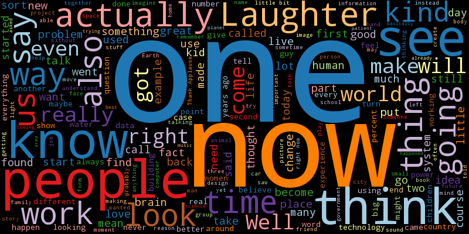
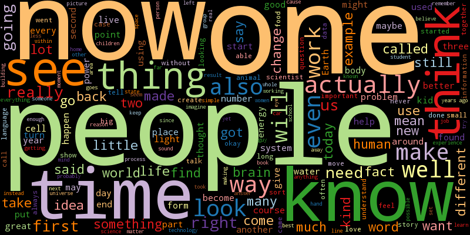
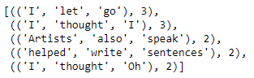
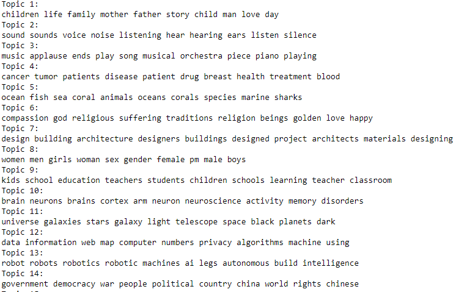
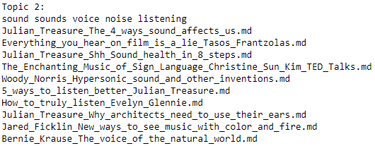
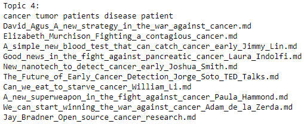
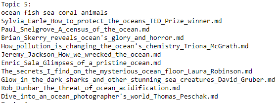

# Data

This repo contains a collection of the extracted narratives from TED (TED, TEDx, TEDEd) talks, that has been forked from [here](https://github.com/saranyan/TED-Talks).

# Natural Language Processing

There are limitless number of things one could achieve with Natural Language Processing. I will be attempting to perform the following:

### Word-Cloud Generation

> A picture is worth a thousand words. 

Word-clouds are brilliant ways to visualize the content of a large body of text. Here is a simple word-cloud from TED talks.

It seems like TED talkers use empowering words like 'now' and 'one' to conjure curiosity amongst the audience. Majority of the talks seem to be funny with the inclusion of 'laughter'.
Let's take a look at TED-ED word-cloud now

It's really interesting to see the massive use of 'people' as it implies that TED-ED talkers mention communties a whole lot more. Also notice words like 'time' and 'know' possibly indicating the relationship between knowledge and the importance of time. A red vertical 'think' appears to the right of the word cloud here is as well. Amongst these words standing out from the rest, we can still notice academic words of context like 'fact','make','thought','life' etc. 

### n-grams

Words by themselves do make sense. Words coupled with other words make more sense. n-grams looks at the coupling of words and we try to analyze the trend from it.

In the context of actual TED talks, n-grams do not reveal the entire story. They rather point in the direction of where the talk topic is located - which brings us to the next section - Topic Modeling.

### Topic Modeling 

Given the diverse selection of TED talks to watch/read, is it possible to generalize into really simple categories?

My Topic Modeling model (NMF) seems to derive these topics. Let's validate them by printing 10 random titles from a particular topic/s.

### Conclusion

The latent topics have been derived from a wide range of subjects and have been categorized based on subtopics. It's interesting to note that some TED talks have a one subject in the topic and a different subject in the actual talk. For example: a Talk with the title 'Immigration Story' would contain a talk that my model classies as being about family, which is accurate to the content of the talk and not the title alone.
 

